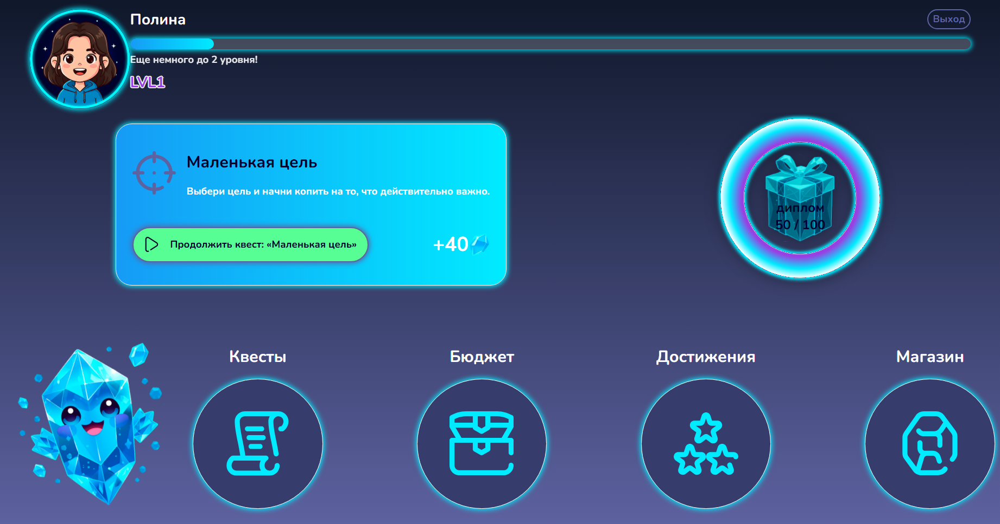
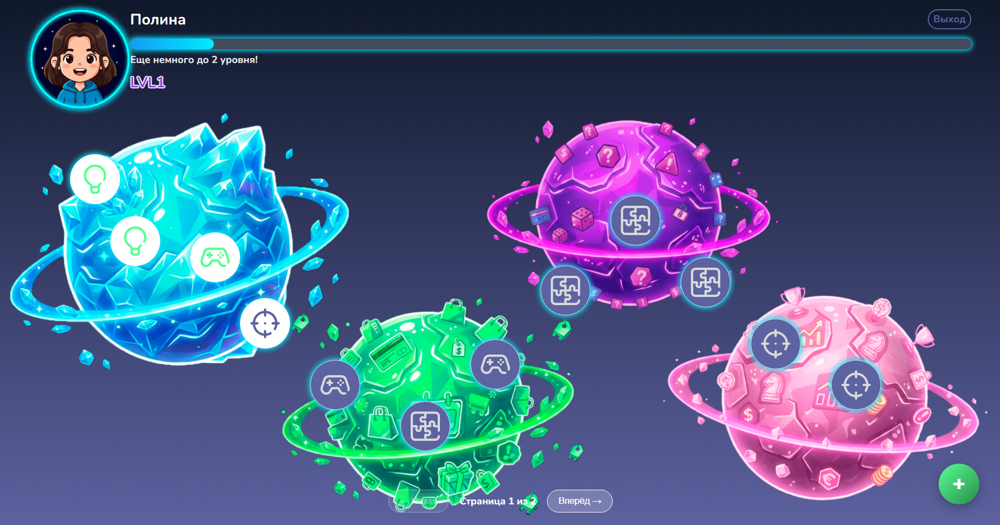
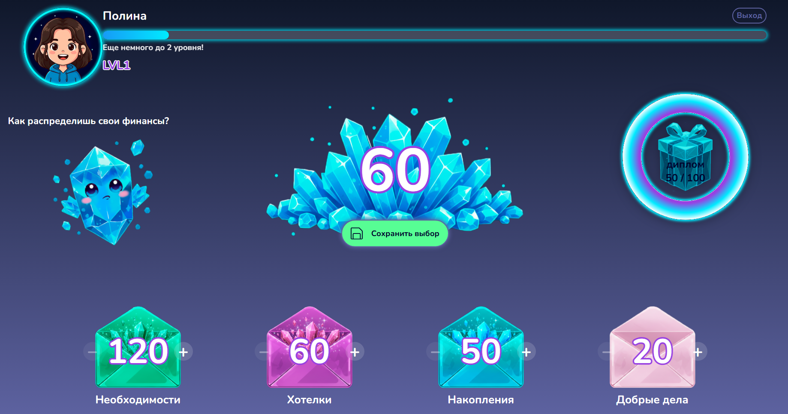
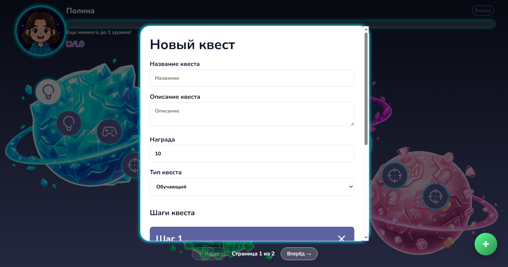

# Финиквест — Фронтенд

Веб-приложение для обучения детей финансовой грамотности через игровые механики. Фронтенд-часть проекта.

## Демо

https://polinasidorina.github.io/my-app

## О проекте

Финиквест — образовательная платформа для детей 9-13 лет, где в игровой форме осваиваются основы финансовой грамотности.

Основные возможности:

- 12 интерактивных квестов с разными типами заданий
- Система бюджетирования (4 конверта, правило 50-20-20-10)
- Уровни и прогресс
- Цели накоплений (копилка)
- Интерактивный туториал с подсветкой
- Админ-панель для создания и редактирования квестов

## Технологии

- React 18.2.0
- TypeScript 4.9.5
- React Router 6.30.3
- CSS Modules

## Установка и запуск

Требования:

- Node.js 18.x или выше
- npm 9.x или выше

Установка зависимостей:
npm install

Запуск в режиме разработки:
npm start

Приложение будет доступно по адресу: http://localhost:3000

Сборка для продакшена:
npm run build

Деплой на GitHub Pages:
npm run deploy

## Структура проекта

src/

├── components/ Переиспользуемые UI-компоненты

├── pages/ Страницы приложения

├── context/ Глобальное состояние (QuestContext)

├── hooks/ Кастомные хуки

├── services/ API-клиент

├── types/ TypeScript-типы

├── utils/ Вспомогательные функции

└── constants/ Константы

## Тестирование

Запуск тестов:
npm test

Запуск тестов с покрытием:
npm test -- --coverage

## Связь с бэкендом

Фронтенд взаимодействует с бэкендом через REST API. Базовый URL бэкенда указан в src/services/api.ts.

Для локальной разработки бэкенд должен быть запущен на порту 5000.

## Автор

Сидорина Полина Андреевна, ННГУ им. Н.И. Лобачевского, 2026

